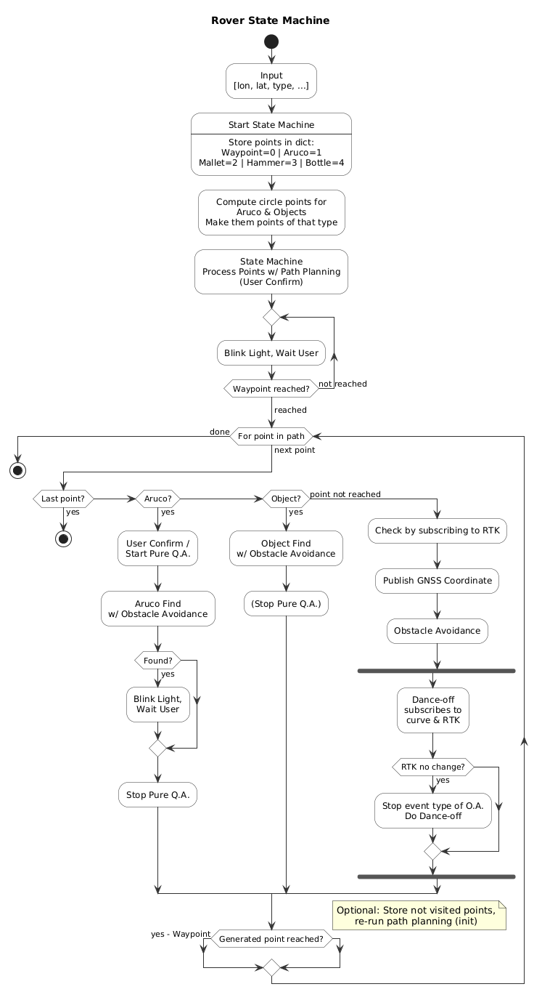

# Overview

This package implements state machine for autonomous rover navigation during URC competition. 
It guides navigation algorithms to reach targets and search for objects on the path. It allows for operator to directly
control state machine through terminal line commands. 

## States

| State | Description |
|---|---|
| `PLANNING` | Waits for the multi-path planner to return optimized routes to all targets. |
| `SPIRAL_PLANNING` | Appends a spiral search path to each non-GNSS target so the rover can sweep the area if the target is not immediately visible. |
| `NAV` | Follows pre-planned waypoints toward the current target. Transitions to `ARUCO_NAV` or `OBJECT_NAV` when within 20 m of a visual target. |
| `ARUCO_NAV` | Hands off to an ArUco-tracking navigation node and follows the spiral search path until the tag is detected or the path is exhausted. |
| `OBJECT_NAV` | Hands off to an object-detection navigation node (mallet, hammer, or bottle) and follows the spiral search path until the object is found or the path is exhausted. |
| `FLASHING` | Reached after a target is confirmed. Flashes the LED green at 2 Hz and waits for an operator `continue` command before advancing to the next target. |
| `MANUAL` | Stops all autonomous nodes, starts the Xbox controller driver, and waits for an operator `continue` command to resume autonomy. |
| `DANCE_OFF` | Reserved. |

## Target Types

Targets are loaded from a `points.txt` or `points.json` file and tagged with one of the following labels:

| Label | Navigation mode |
|---|---|
| `gnss` | GPS waypoint only — no spiral search. |
| `aruco1` | 5–10 m spiral search radius, ArUco detection. |
| `aruco2` | 10–20 m spiral search radius, ArUco detection. |
| `mallet` | 0–3 m spiral search radius, object detection. |
| `hammer` | 0–3 m spiral search radius, object detection. |
| `bottle` | 0–10 m spiral search radius, object detection. |

## ROS 2 Interface

**Subscriptions**

| Topic | Type | Description |
|---|---|---|
| `rover1/ubx_nav_pvt` | `ublox_ubx_msgs/UBXNavPVT` | GNSS fix from antenna 1. |
| `rover2/ubx_nav_pvt` | `ublox_ubx_msgs/UBXNavPVT` | GNSS fix from antenna 2. |
| `/state_machine_controller` | `std_msgs/String` | Operator commands (`stop`, `continue`). |
| `reached_signal` | `std_msgs/Bool` | Signal from ArUco/object nav that a target was reached. |
| `spiral_path` | `geographic_msgs/GeoPath` | Spiral search path returned by the spiral planner. |

**Publications**

| Topic | Type | Description |
|---|---|---|
| `waypoint` | `std_msgs/Float64MultiArray` | Next `[lat, lon]` waypoint for the active nav node. |
| `spiral_request` | `std_msgs/Float64MultiArray` | Spiral search request `[center_lat, center_lon, approach_lat, approach_lon, r_min, r_max]`. |
| `led` | `std_msgs/Float32MultiArray` | RGB LED color command. Red = planning, green flash = target reached, blue = manual. |

**Service Clients**

| Service | Type | Description |
|---|---|---|
| `multi_path_plan` | `wr_interfaces/MultiPathPlan` | Requests optimized routes from the current position to all targets. |

## Nodes

- **`state_machine`** (`state_machine_node.py`) — Main state machine node running at 20 Hz.
- **`state_machine_controller`** (`state_machine_controller_node.py`) — Operator console node; reads `continue` / `stop` from stdin and publishes to `/state_machine_controller`.



# Installation

**1. Build the ROS 2 package**
From the `wr_workspace` folder, run:
```bash
colcon build
source install/setup.bash
```

**2. Run state machine**

To launch rover state machine, run:
```bash
ros2 run state_machine state_machine
```
If you want to specify custom points config file, run
```
ros2 run state_machine state_machine --ros-args -p points_file_path:=<points_file_path>
```
To send commands to the state machine from the terminal, run
```
ros2 run state_machine state_machine_controller
```

